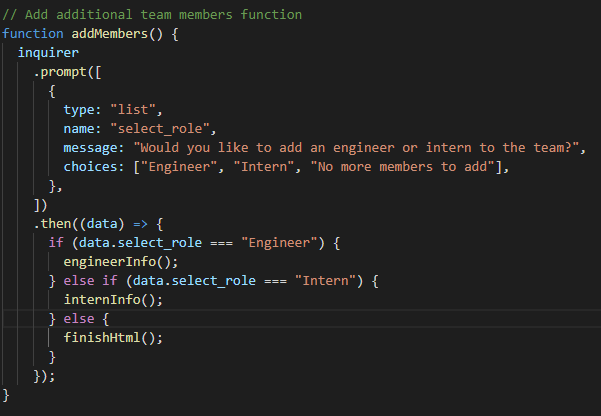

# NBM-Team-Profile-Generator

## USER STORY

    AS A Web developer
    I WANT to create an index.html generator that displays a webpage of a user's basic info supplied through inquirer prompts
    SO THAT I can display my skills and understanding of object oriented programming and file generation through node.

## DESCRIPTION
A command line application that acts as a software engineering team-generator by prompting the user for role information about the team manager and subsequent information about the following team members. Any number of team members can be submitted to the application with no limit on either engineers or interns. Once all relevant information is submitted and the questionaire is complete, an HTML page is generated that displays styled information cards for each member of the team.

## APPLICATION IN USE

TEST FUNCTIONS
[TeamProfileGeneratorTests](https://www.youtube.com/watch?v=K2znuq4rB3Y "Team Profile Generator Tests")

USING THE APPLICATION
[TeamProfileGeneratorApplication](https://www.youtube.com/watch?v=A5XksZJmTYY "Team Profile Generator Application in Use")

## TABLE OF CONTENTS
- [INSTALLATION](#installation)
- [USAGE](#usage)
- [LICENSE](#license)
- [CONTRIBUTING](#contributing)
- [QUESTIONS](#questions)

## INSTALLATION

Create an npm init package before downloading necessary dependencies. After this, my next step was to build each roles class attributes and constructors to base my tests and inquirer questions around. Once this was completed, I created some test functions to run and make sure user inputs would work based on their submitted information. The next step was to create an inquirer prompt to accept user input that would fill out the relevant project information for each member of the team and their different roles. Once the prompt was complete, the final step was to create an HTML renderer function that would compile the user's supplied information to generate and display a well-formatted HTML page of their inputted team members.

Package.JSON modules

Employee Class Constructor

Employee Test Function

Manager Inquirer Questionaire

Manager HTML Renderer 

Add Members Questionaire

Finished HTML Page

## USAGE 
Though the current roles are for managers, engineers, and interns, I believe this application can be used for any time of multi-member team creation and can help build an easy to understand list of team members in order of position and relevant role information.

## LICENSE

The license included for the project is under ISC

## CONTRIBUTING 
https://uwa.bootcampcontent.com/UWA-Bootcamp/uw-blv-virt-fsf-pt-12-2021-u-c/-/tree/master/10-OOP/01-Activities was used as reference for class constructor builds as well as working together with fellow teammates Lamor Odingo and Taylor Thompson to brainstorm and troubleshoot errors.

## CHALLENGES FACED 
My biggest challenge with this project was figuring out how to generate an index.html file in separate chunks based on how many of each role were created, and how it would render within the HTML. My biggest fear was that some pieces would be generated before the main structuring of the HTML and would cause either serious design issues, or just not work all together.

## FUTURE DEVELOPMENTS 
With more development time I would like to incorporate some fontawesome icons for each role and do some additional tweaks to the design elements of the finished HTML to make for a more visually appealing product. But for now, I feel content with my current design as it reminds me of past IOS designs.

## QUESTIONS
If you have any further questions about this module or improvement ideas, please feel free to connect on either GitHub or LinkedIn, or email me at:
* GitHub: https://github.com/NathanMilburn
* LinkedIn: https://www.linkedin.com/in/nathan-milburn-55487513a/
* E-Mail: nathan.milburn@outlook.com